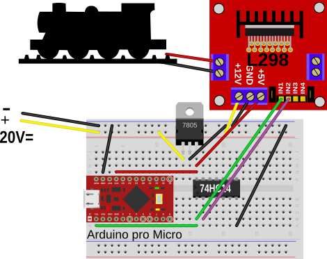

# Maerklin for Arduino

This repository contains code to control Maerklin digital
model train engines using a Arduino Pro Micro and the
L298 bridge driver.

Three demos are provided. All three will blink the lights of
a Maerlkin steam engine.

## mmtestuart

This demo uses the USART in UART mode to generate the necessary
signals. It's the easiest one to understand as it uses the standard
Serial interface but generates some of the timing using busy waits.

## mmtestmspi

This demo uses the USART in SPI mode to generate the necessary
signals. This is similar to the UART variant but implemts SPI mode which
is technically simpler but requires direct hardware programming
to achieve the correct timing. This still needs some busy waiting code
and is thus difficult to combine with other code.

## mmtestmspiirq

This demo uses the USART in SPI mode and an interrupt handler to
generate the necessary signals. This solution is the most complex one
as the entire timing is generated within an interrupt handler.  The
big advantage of this solution is that the entire signal generation
runs in the background and no blocking busy waits are needed. The
entire arduinos is thus free to do other operations in the foreground like
doing USB communication to send and receive control commands.
